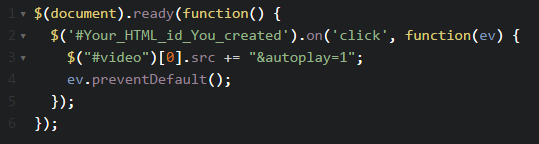

# Διαδραστικά Παραδείγματα

Σε αυτό το τμήμα μελετάμε μέσα από απλά παραδείγματα τη διάδραση του χρήστη με τον υπολογιστή. Εστιάζουμε την προσοχή μας σε ιδιότητες του διαδικτύου και ειδικά στα συστήματα εισόδου και εξόδου. Τα παραδείγματα έχουν αναπτυχθεί σε γλώσσες προγραμματισμού html, css, javascript καθώς και εξωτερικές βιβλιοθήκες.

# Κεφάλαιο: Μέθοδος

### Παράδειγμα εισόδου χρησιμοποιώντας  το ποντίκι Νο.1

Παράδειγμα διαδραστικού κώδικα που χρησιμοποιεί το ποντίκι ως συσκευή εισόδου. Ο χρήστης μπορεί να χρησιμοποιήσει το ποντίκι για να σχεδιάσει στη λευκή επιφάνεια (canvas). 

See the Pen <a href='http://codepen.io/sckarolos/pen/MwxdgM/'>html canvas draw</a> by sckarolos (<a href='http://codepen.io/sckarolos'>@sckarolos</a>) on <a href='http://codepen.io'>CodePen</a>.

Άσκηση: Τρποποποιήστε το παράδειγμα έτσι ώστε όταν δίνεται ως είσοδος ένα συγκεκριμένο πλήκτρο από το πληκτρολόγιο (π.χ. Space), να εκτελείται η λειτουργία reset / clear στo canvas (επαναφορά στη λευκή επιφάνεια). 

### Παράδειγμα εισόδου χρησιμοποιώντας  το ποντίκι Νο.2

Το συγκεκριμένο παράδειγμα υλοποιεί την ίδια λειτουργία με το παράδειγμα "Παράδειγμα εισόδου χρησιμοποιώντας  το ποντίκι 1", υλοποιημένο αυτή τη φόρά σε κώδικα Processing.

<iframe id='ifr' width='640' height='350' scrolling='no' style='background: url(http://studio.processingtogether.com/static/img/jun09/pad/connectingbar.gif) no-repeat center 60px;' src='http://studio.processingtogether.com/sp/pad/iframe/ro.9Ph9ME6QCBN6d/rev.1?autostart=1'></iframe>

Άσκηση: Υλοποιήστε την άσκηση του προηγούμενου παραδείγματος "Παράδειγμα εισόδου χρησιμοποιώντας  το ποντίκι 1" κάνοντας τις κατάλληλες τροποποιήσεις αυτή τη φορά σε κώδικα Processing. Επισημάνετε τις ομοιότητες και τις διαφορές.

### Παράδειγμα εισόδου χρησιμοποιώντας  το ποντίκι Νο.2

Παράδειγμα διαδραστικού κώδικα Processing. Στο παράδειγμα αυτό 2 δυναμικές ευθείες γραμμές τέμνονται στο σημείο όπου βρίσκεται κάθε φορά ο κέρσορας του ποντικιού.

<iframe id='ifr' width='640' height='350' scrolling='no' style='background: url(http://studio.processingtogether.com/static/img/jun09/pad/connectingbar.gif) no-repeat center 60px;' src='http://studio.processingtogether.com/sp/pad/iframe/ro.9Ske7AFEjdlpy/rev.33?autostart=1'></iframe>

Άσκηση: Τροποποιήστε το παράδειγμα έτσι ώστε: 

1. Να μεταβάλλεται το opacity του background ανάλογα με την κίνηση του ποντικιού στον άξονα y.

2. Να μεταβάλλεται το χρώμα το opacity των τεμνόμενων γραμμών ανάλογα με την κίνηση του ποντικιού στον άξονα x.

### Παράδειγμα CSS Media Queries

Παράδειγμα κώδικα με σκοπό να γίνει κατανοητή η χρήση των CSS media queries. Αλλάζοντας το μέγεθος του παραθύρου του περιηγητή (browser) σας αλλάζει το χρώμα της επιφάνειας του παραδείγματος. 

See the Pen <a href='http://codepen.io/sckarolos/pen/vOoyJG/'>media queries example</a> by sckarolos (<a href='http://codepen.io/sckarolos'>@sckarolos</a>) on <a href='http://codepen.io'>CodePen</a>.

Άσκηση: Πειραματιστείτε με το παράδειγμα προσθέτοντας περισσότερα CSS media queries και αλλάζοντας το χρώμα του παραθούρου. Στη συνέχεια δοκιμάστε να εφαρμόσετε CSS media queries στο μέγεθος της γραμματοσειράς ώστε να απεικονίζεται σωστά σε όλα τα μεγέθη παραθύρων.

# Κεφάλαιο: Αρχέτυπα

### Παράδειγμα εισόδου μέσω της συσκευής ΠοντίκιΝο.3

Παράδειγμα διαδραστικού κώδικα που χρησιμοποιεί το ποντίκι ως συσκευή εισόδου και δίνει ως έξοδο το ανάλογο αποτέλεσμα στην οθόνη. Για να αλλάξει η τιμή εισόδου πρέπει ο χρήστης να κυλίσει δεξιά ή αριστερά το πορτοκαλί "κουμπί ώστε να αλλάξει η τιμή εισόδου".

See the Pen <a href='http://codepen.io/sckarolos/pen/ZGVrjJ/'>ZGVrjJ</a> by sckarolos (<a href='http://codepen.io/sckarolos'>@sckarolos</a>) on <a href='http://codepen.io'>CodePen</a>.

Άσκηση: Αλλάξτε το χρώμα του αριθμού εξόδου, κάθε φορά που κινείται η μπάρα εισόδου. 

### Παράδειγμα εισόδου μέσω της συσκευής ΠοντίκιΝο.4

Παράδειγμα διαδραστικού κώδικα που χρησιμοποιεί το ποντίκι ως συσκευή εισόδου για τη συμπλήρωση της φόρμας και δίνει ως έξοδο το ανάλογο αποτέλεσμα στην οθόνη.

See the Pen <a href='http://codepen.io/sckarolos/pen/vNYZXK/'>Form Example</a> by sckarolos (<a href='http://codepen.io/sckarolos'>@sckarolos</a>) on <a href='http://codepen.io'>CodePen</a>.

Άσκηση: Τροποποιήστε το παράδειγμα προσθέτοντας ένα ακόμα κελί στη φόρμα. Το νέο κελί πρέπει να έχει προεπιλεγμένη τιμή "Gender" και οι διαθέσιμες επιλογές να είναι "Male","Female". Τοποθετείστε το κελί όπου εσείς θέλετε μέσα στο υπάρχον box.

### Παράδειγμα εισόδου μέσω της συσκευής ΠοντίκιΝο.5

Παράδειγμα διαδραστικού κώδικα όπου ο χρήστης χρησιμοποιώντας το ποντίκι, πατώντας το κουμπί "ANOTHER" μπορεί να αλλάξει τα εκτυπωμένα μηνύματα.

See the Pen <a href='http://codepen.io/sckarolos/pen/dYyRJX/'>JS fitness 3: Dev compliment generator</a> by sckarolos (<a href='http://codepen.io/sckarolos'>@sckarolos</a>) on <a href='http://codepen.io'>CodePen</a>.

Άσκηση: Τροποποιήστε το παράδειγμα δημιουργώντας ένα 2ο κουμπί που θα εκτελεί τη την ανάποδη λειτουργία από αυτή του κουμπιού "ANOTHER". Το νέο κουμπί πρέπει να εμφανίζει το μήνυμα που είχε εμφανιστεί προηγουμένως. 

### Παράδειγμα εισόδου μέσω της συσκευής ΠοντίκιΝο.6

Παράδειγμα διαδραστικού κώδικα όπου ο χρήστης χρησιμοποιώντας το ποντίκι, μπορεί να αλλάξει δυναμικά το περιεχόμενο που θα εμφανίζεται στη σελίδα. Για το σκοπό αυτό γίνεται χρήση της Javascript βιβλιοθήκης  AngularJS (https://angularjs.org/).

See the Pen <a href='http://codepen.io/sckarolos/pen/zvYzPg/'>Simple content toggle with AngularJS</a> by sckarolos (<a href='http://codepen.io/sckarolos'>@sckarolos</a>) on <a href='http://codepen.io'>CodePen</a>.

Άσκηση: Τροποποιήστε το παράδειγμα δημιουργώντας περισσότερες επιλογές στη φόρμα περιεχομένων. Δοκιμάστε να φέρετε δυναμικά στη σελίδα διαφορετικό περιεχόμενο (π.χ. εικόνες).

# Κεφάλαιο: Εργαλεία 

### Παράδειγμα Μενού Νο.1

Διαδραστικό παράδειγμα dropdown μενού χωρίς τη χρήση Javascript.

See the Pen <a href='http://codepen.io/sckarolos/pen/dorrVa/'>Simple Dropdown menu</a> by sckarolos (<a href='http://codepen.io/sckarolos'>@sckarolos</a>) on <a href='http://codepen.io'>CodePen</a>.

Άσκηση: Τροποποιήστε το παράδειγμα με τη βοήθεια των CSS3 Media Queries έτσι ώστε το μενού να γίνει responsive, λειτουργώντας κατάλληλα στα βασικά μεγέθη οθόνης.

### Παράδειγμα Μενού Νο.2

Παράδειγμα slide μενού χωρίς ενσωματωμένες λειτουργίες.

See the Pen <a href='http://codepen.io/sckarolos/pen/LVwxER/'>Slide Menu</a> by sckarolos (<a href='http://codepen.io/sckarolos'>@sckarolos</a>) on <a href='http://codepen.io'>CodePen</a>.

Άσκηση: Τροποποιήστε το παράδειγμα αφαιρώντας τον κώδικα που δημιουργεί το μενού στη δεξιά πλευρά της σελίδας. Στη συνέχεια, πειραματιστείτε με τον preprocessor SCSS παρατηρώντας τις ομοιότητες και τις διαφορές με το κανονικό CSS.

### Παράδειγμα Μενού Νο.3

Διαδραστικό παράδειγμα responsive μενού σε One page template χρησιμοποιώντας τη βιβιοθήκη Τwitter Βootstrap 3.0 . Στο παράδειγμα εμφανίζεται το μενού έπειτα από κύλιση του ποντικιού και υποστηρίζεται η λειτουργία αυτόματης μεταφοράς (scroll) στην ενότητα/κεφάλαιο που θα επιλέξει ο χρήστης μέσω του μενού. 

See the Pen <a href='http://codepen.io/sckarolos/pen/yNdPrJ/'>responsive menu</a> by sckarolos (<a href='http://codepen.io/sckarolos'>@sckarolos</a>) on <a href='http://codepen.io'>CodePen</a>.

Άσκηση 1: Δημιουργείστε ένα επιπλέον στοιχείο στο μενού και κατόπιν φτιάξτε μια αντίστοιχη ενότητα/κεφάλαιο στο τέλος της σελίδας. Εφαρμόστε την λειτουργία scroll-to συνδέοντας το μενού με την καινούρια ενότητα/κεφάλαιο.

Άσκηση 2: Δημιουργείστε κουμπί στο τέλος της σελίδας. Κάθε φορά που το επιλέγει ο χρήστης να εκτελείται μεταφορά (scroll) στην πρώτη/αρχική ενότητα/κεφάλαιο.

### Παράδειγμα Μενού Νο.4

Διαδραστικό παράδειγμα πολύπλοκου κυκλικού μενού. Με την επιλογή του κουμπιού "open" από το χρήστη, εμφανίζονται μια σειρά από πιθανές επιλογές.

See the Pen <a href='http://codepen.io/sckarolos/pen/eNwepm/'>Circular Navigation example</a> by sckarolos (<a href='http://codepen.io/sckarolos'>@sckarolos</a>) on <a href='http://codepen.io'>CodePen</a>.

Άσκηση: Τροποποιήστε το μενού κατάλληλα ώστε κατά την επιλογή του κουμπιού open να εμφανίζονται 4 και όχι 12 επιλογές.

### Παράδειγμα Μενού Νο.5

Παράδειγμα εναλλακτικού μενού χωρίς τη χρήση Javascript. Για τη δημιουργία της διάδρασης έχει χρησιμοποιηθεί ο CSS preprocessor SCSS.

See the Pen <a href='http://codepen.io/sckarolos/pen/vOommL/'>Pure CSS Circle Menu</a> by sckarolos (<a href='http://codepen.io/sckarolos'>@sckarolos</a>) on <a href='http://codepen.io'>CodePen</a>.

Άσκηση: Τροποποιήστε το παράδειγμα ενσωματώνοντας στο υπάρχον μενού περιεχόμενο της επιλογής σας. Αντί για CSS, χρησιμοποιήστε τον Preprocessor SCSS.

### Παράδειγμα Μενού Νο.6

Παράδειγμα εναλλακτικού μενού χωρίς ενσωματωμένες λειτουργίες.

See the Pen <a href='http://codepen.io/sckarolos/pen/zGVpNR/'>tablet menu</a> by sckarolos (<a href='http://codepen.io/sckarolos'>@sckarolos</a>) on <a href='http://codepen.io'>CodePen</a>.

Άσκηση: Ενσωματώστε το παραπάνω μενού στο παράδειγμα "Παράδειγμα Μενού 2" αφού πρώτα αφαιρέσετε το υπάρχον μενού. Στη συνέχεια ενσωματώστε τις προϋπάρχουσες λειτου ργίες στο καινούριο μενού. Προεραιτικά χρησιμοποιήστε στο μενού τοποθέτηση fixed (position:fixed;) ώστε να φαίνεται πάντα κατά την κύλιση ή τη μεταφορά στις διάφορες ενότητες.

# Κεφάλαιο: Μοντέλα

### Παράδειγμα εφαρμογής φίλτρου σε εικόνα 

Παράδειγμα διαδραστικού κώδικα στον οποίο όταν εκτελείται από το χρήστη η λειτουργία hover (κίνηση του ποντικιού πάνω από την εικόνα στο συγκεκριμένο παράδειγμα) εφαρμόζεται το φίλτρο του αποχρωματισμού της εικόνας. 

See the Pen <a href='http://codepen.io/sckarolos/pen/VLJWMQ/'>image filter 1</a> by sckarolos (<a href='http://codepen.io/sckarolos'>@sckarolos</a>) on <a href='http://codepen.io'>CodePen</a>.

Άσκηση: Τροποποιήστε το παράδειγμα χρησιμοποιώντας φίλτρα εικόνας και συνδυασμούς αυτών. Παραδείγματα φίλτρων βρίσκονται ως σχόλια στην ενότητα με τον CSS κώδικα του παραδείγματος.

### Παράδειγμα εφαρμογής εφέ σε εικόνα 

Παράδειγμα διαδραστικού κώδικα στον οποίο όταν εκτελείται από το χρήστη η λειτουργία hover (κίνηση του ποντικιού πάνω από την εικόνα στο συγκεκριμένο παράδειγμα) μεγενθύνεται η εικόνα (zoom) χωρίς να αλλάζουν οι διαστάσεις του πλαισίου . 

See the Pen <a href='http://codepen.io/sckarolos/pen/xwxrPb/'>Background Image zoom</a> by sckarolos (<a href='http://codepen.io/sckarolos'>@sckarolos</a>) on <a href='http://codepen.io'>CodePen</a>.

Άσκηση: Τροποποιήστε το παράδειγμα χρησιμοποιώντας φίλτρα εικόνας από το προηγούμενο παράδειγμα. Συνδυάστε τα φίλτρα εικόνας και τη χρήση zoom κατά τη λειτουργία hover (κίνηση του ποντικιού πάνω από την εικόνα).

### Παράδειγμα διαδραστικού ρολογιού

Διαδραστικό παράδειγμα κώδικα Processing λειτουργικής εξομοίωσης ρολογιού.

<iframe id='ifr' width='640' height='350' scrolling='no' style='background: url(http://studio.processingtogether.com/static/img/jun09/pad/connectingbar.gif) no-repeat center 60px;' src='http://studio.processingtogether.com/sp/pad/iframe/ro.9GXKOUspGtjB1/rev.26?autostart=1'></iframe>

Άσκηση: Τροποποιήστε το παράδειγμα έτσι ώστε ανάλογα με την κίνηση των δεικτών του ρολογιού να τυπώνεται η ώρα σε ψηφιακή μορφή. Μπορείτε να χρησιμοποιήσετε ως βοήθεια κάποιο από τα παραδείγματα:

http://www.openprocessing.org/search/?q=digital+clock

### Παράδειγμα αριθμομηχανής

Παράδειγμα οπτικής και λειτουργικής εξομοίωσης αριθμομηχανής. 

See the Pen <a href='http://codepen.io/sckarolos/pen/vOqewJ/'>Apple's Calculator fork</a> by sckarolos (<a href='http://codepen.io/sckarolos'>@sckarolos</a>) on <a href='http://codepen.io'>CodePen</a>.

Άσκηση 1: Τροποποιήστε το παράδειγμα έτσι ώστε κάθε φορά που επιλέγεται το σύμβολο/τελεστής "=" να τυπώνεται το αποτέλεσμα σε όποιο μέρος της σελίδας επιθυμείτε. Το επόμενο αποτέλεσμα πρέπει να τυπώνεται σε νέα σειρά.

### Παράδειγμα διαδραστικού χάρτη 

Έυρεση τοποθεσίας χρήστη χρησιμοποιώντας το Google Maps API (https://developers.google.com/maps/?hl=en).

See the Pen <a href='http://codepen.io/sckarolos/pen/WvmOXo/'>google maps user's Geolocation</a> by sckarolos (<a href='http://codepen.io/sckarolos'>@sckarolos</a>) on <a href='http://codepen.io'>CodePen</a>.

Άσκηση: Τροποποιήστε το παράδειγμα δημιουργώντας/οπτικοποιώντας χρωμματική περίμετρο γύρω από το σημείο εντοπισμού.

### Παράδειγμα Διαδραστικού χάρτη 

Εύρεση τοποθεσίας μέσω της χρήσης φόρμας εισόδου και του Google Maps API (https://developers.google.com/maps/?hl=en).

See the Pen <a href='http://codepen.io/sckarolos/pen/XbGgZq/'>google maps api place search</a> by sckarolos (<a href='http://codepen.io/sckarolos'>@sckarolos</a>) on <a href='http://codepen.io'>CodePen</a>.

Άσκηση 1: Κάθε φορά που δίνεται ως είσοδος μια τοποθεσία αλλάζει το κέντρο του χάρτη. Τροποποιήστε το παράδειγμα έτσι ώστε κάθε φορά που αλλάζει το κέντρο του χάρτη, να φαίνεται μεγαλύτερο κομμάτι της εκάστοτε περιοχής (μείωση της τιμής zoom)

Άσκηση 2: Τροποποιήστε του προεπιλεγμένου (default) marker που χρησιμοποιείται για την εύρεση του σημείου που αναζητήσατε με ένα marker της επιλογής σας.

Άσκηση 3: Δοκιμάστε παραδείγματα απο το documentation του Google Maps API (https://developers.google.com/maps/?hl=en).

# Κεφάλαιο: Σύνθεση

### Παράδειγμα αναπαραγωγής βίντεο χρησιμοποιώντας το ποντίκι

Παράδειγμα διαδραστικού κώδικα που χρησιμοποιεί το ποντίκι ως συσκευή εισόδου. Το βίντεο χρησιμοποιεί για την έναρξη και την παύση του το σύστημα αναπαραγωγής της υπηρεσίας Youtube. 

See the Pen <a href='http://codepen.io/sckarolos/pen/yNWZwm/'>video example</a> by sckarolos (<a href='http://codepen.io/sckarolos'>@sckarolos</a>) on <a href='http://codepen.io'>CodePen</a>.

Άσκηση: Δημιουργείστε δικό σας σύστημα αναπαραγωγής με κουμπιά Start (εκκίνηση) και Pause (Διακοπή) τα οποία να εκτελούν τις αντίστοιχες λειτουργίες στο υπάρχον Βίντεο. Για εκκίνηση του βίντεο μπορεί να χρησιμοποιηθεί το εξής παράδειγμα κώδικα Javascript:

### Παράδειγμα διαδραστικού παιχνιδιού 

Μετακίνηση αντικειμένου μέσω πληκτρολογίου (html Canvas)

See the Pen <a href='http://codepen.io/sckarolos/pen/dorEYW/'>html canvas game</a> by sckarolos (<a href='http://codepen.io/sckarolos'>@sckarolos</a>) on <a href='http://codepen.io'>CodePen</a>.

Άσκηση 1: Τροποποιήστε το παράδειγμα έτσι ώστε όταν το αυτοκίνητο κινείται όπισθεν να έχει μικρότερη (τη μισή) ταχύτητα από το όταν κινείται έμπροσθεν. 

Άσκηση 2: Δημιουργείστε περιμετρικά όρια  έτσι ώστε το αυτοκίνητο να μη βγαίνει ποτέ έξω από την πίστα.

### Παράδειγμα σύνθεσης διαδραστικών εικόνων

Διαδραστικό παράδειγμα εικόνων χρησιμοποιώντας την τεχνική parallax. Στο συγκεκριμένο παράδειγμα η τεχνική αυτή δημιουργεί την αίσθηση του 3d περιβαλλντος. Ο χρήστης μπορεί να περιηγηθεί στη σύνθεση χρησιμοποιώντας το ποντίκι.

See the Pen <a href='http://codepen.io/sckarolos/pen/yNmMLO/'>GTA 5 CSS3 Parallax</a> by sckarolos (<a href='http://codepen.io/sckarolos'>@sckarolos</a>) on <a href='http://codepen.io'>CodePen</a>.

Άσκηση 1: Τροποποιήστε το παράδειγμα αλλάζοντας τις υπάρχουσες εικόνες, δημιουργώντας τη δική σας θεματική σύνθεση. 

### Παράδειγμα διαδραστικού γραφήματος

Διαδραστικό παράδειγμα γραφήματος χρησιμοποιώντας τη βιβλιοθήκη d3.js / dimple.js (http://d3js.org , http://dimplejs.org)

See the Pen <a href='http://codepen.io/sckarolos/pen/pJYmOJ/'>d3 bar chart example</a> by sckarolos (<a href='http://codepen.io/sckarolos'>@sckarolos</a>) on <a href='http://codepen.io'>CodePen</a>.

Άσκηση 1: Δημιουργείστε ένα αρχείο της επιλογής σας (πχ.: .csv,.tsv,.json κτλ) και προσθέστε στην κατάλληλη μορφή τα δεδομένα που οπτικοποιεί το παράδειγμα (πίνακας data στην ενότητα Javascript).

Άσκηση 2: Ανεβάστε το αρχείο σε μια υπηρεσία που επιτρέπει τη δωρεάν αποθήκευση αρχείων (π.χ.: Github, Dropbox).  

Άσκηση 3: Τροποποιήστε το παράδειγμα κατάλληλα ώστε να γίνεται φόρτωση και προσπέλαση των δεδομένων από το αρχείο που δημιουργήσατε.

Άσκηση 4: Προσθέστε περισσότερα δεδομένα στο αρχείο και δοκιμάστε παραδείγματα απο το documentation της βιβλιοθήκης (http://dimplejs.org/).

### Παράδειγμα διαδραστικού γραφήματος

Διαδραστικό παράδειγμα γραφήματος χρησιμοποιώντας τη βιβλιοθήκη d3.js (http://d3js.org). Το παράδειγμα οπτικοποιεί 2 διαφορετικά σετ δεδομένων (datasets).

See the Pen <a href='http://codepen.io/sckarolos/pen/vOoeGE/'>D3 chart 2</a> by sckarolos (<a href='http://codepen.io/sckarolos'>@sckarolos</a>) on <a href='http://codepen.io'>CodePen</a>.

Άσκηση: Τροποποιήστε τον κώδικα του παραδείγματος προσθέτοντας και οπτικοποιώντας στο ίδιο πλαίσιο περισσότερα από 2 σετ δεδομένων (datasets). 

### Παράδειγμα δημιουργίας φωτισμού

Διαδραστικό παράδειγμα κώδικα Processing που δημιουργεί φωτισμό (Directional light) σε μια σφαίρα. Ο φωτισμός μεταβάλλεται με την κίνηση του ποντικιού.

<iframe id='ifr' width='640' height='340' scrolling='no' style='background: url(http://studio.processingtogether.com/static/img/jun09/pad/connectingbar.gif) no-repeat center 60px;' src='http://studio.processingtogether.com/sp/pad/iframe/ro.98gblKGHeHScC/rev.7?autostart=1'></iframe>

Άσκηση: Πειραματιστείτε με τον κώδικα του παραδείγματος αλλάζοντας το χρώμα και τη γωνία πτώσης του φωτός στη σφαίρα.

# Κεφάλαιο: Μορφές 

### Παράδειγμα με είσοδο κάμερα

Διαδραστικό παράδειγμα κώδικα Processing. Το παράδειγμα χρησιμοποιεί ως είσοδο κάμερα και εφαρμόζει διαδραστικό πλέγμα/φίλτρο που λειτουργεί και ως έξοδος των όσως καταγράφει η κάμερα. Για να γίνει αντιληπτό το αποτέλεσμα του παραδείγματος είναι απαραίτητη η χρήση Web κάμερας. 

<iframe id='ifr' width='640' height='350' scrolling='no' style='background: url(http://studio.processingtogether.com/static/img/jun09/pad/connectingbar.gif) no-repeat center 60px;' src='http://studio.processingtogether.com/sp/pad/iframe/ro.91scCw0Aios3L/rev.16?autostart=0'></iframe>

Ασκηση: Ταυτόχρονα με την καταγραφή δεδομένων μέσω της κάμερας, πειραματιστείτε διαδρώντας με το πλέγμα χρησιμοποιώντας το ποντίκι. Ποια είναι τα σχόλιά σας;

### Παράδειγμα με είσοδο κάμερα 2

Διαδραστικό παράδειγμα κώδικα με χρήση κάμερας. Στο παράδειγμα υπάρχει δύο διαφορετικά πλαίσια (πράσινο και κόκκινο). Όταν εντοπιστεί κίνηση σε κάποιο πλαίσιο εμφανίζεται το αντίστοιχο μήνυμα. Για να γίνει αντιληπτό το αποτέλεσμα του παραδείγματος είναι απαραίτητη η χρήση Web κάμερας. 

See the Pen <a href='http://codepen.io/sckarolos/pen/yYLKBj/'>Motion Detection</a> by sckarolos (<a href='http://codepen.io/sckarolos'>@sckarolos</a>) on <a href='http://codepen.io'>CodePen</a>.

Ασκηση: Τροποποιήστε τον κώδικα έτσι ώστε όταν εντοπίζεται κίνηση και στα δύο πλαίσια ταυτόχρονα να εμφανίζεται ένα νέο μήνυμα χωρίς να γίνει εμφάνιση των προηγούμενων.

### Παράδειγμα με είσοδο κάμερα 3

Διαδραστικό παράδειγμα κώδικα με χρήση κάμερας. Στο παράδειγμα υπάρχει ένα πλαίσιο πράσινου χρώματος . Όταν εντοπιστεί κίνηση μέσα στο πλαίσιο αλλάζει το χρώμα του background της σελίδας. Για να γίνει αντιληπτό το αποτέλεσμα του παραδείγματος είναι απαραίτητη η χρήση Web κάμερας. 

See the Pen <a href='http://codepen.io/sckarolos/pen/VvwXjv/'>Motion Detection with Javascript Canvas</a> by sckarolos (<a href='http://codepen.io/sckarolos'>@sckarolos</a>) on <a href='http://codepen.io'>CodePen</a>.

Ασκηση: Τροποποιήστε τον κώδικα έτσι ώστε όταν εντοπίζεται κίνηση, το χρώμα του background να αλλάζει σε ένα συγκεκριμένο της επιλογής σας.

### Παράδειγμα αναπαραγωγής ήχου

Διαδραστικό παράδειγμα κώδικα που αναπαριστά ένα απλό σύστημα αναπαραγωγής ήχου. Κατά την επιλογή του κεντρικού εικονιδίου ξεκινάει η αναπαραγωγή του αρχείου ήχου. Για να γίνει αντιληπτό το αποτέλεσμα του παραδείγματος είναι απαραίτητη η χρήση ηχείων εξόδου. 

See the Pen <a href='http://codepen.io/sckarolos/pen/OyJzZq/'>SoundCloud Mini player with css record animation</a> by sckarolos (<a href='http://codepen.io/sckarolos'>@sckarolos</a>) on <a href='http://codepen.io'>CodePen</a>.

Ασκηση: Τροποποιήστε τον κώδικα αλλάζοντας το υπάρχον αρχείο αναπαραγωγής με ένα άλλο της επιλογής σας. Κάντε το ίδιο για την αντίστοιχη εικόνα του παραδείγματος.

### Links παραδειγμάτων απανταχού υπολογίζειν

Παραδείγματα Arduino Board: http://playground.arduino.cc/Main/InterfacingWithHardware#InputTOC

Παραδείγματα Beagleboard Board: http://beagleboard.org/Support/BoneScript

Παραδείγματα raspberrypi Board: https://www.raspberrypi.org


